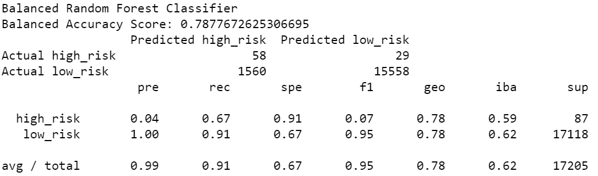

# Credit_Risk_Analysis

## Overview

This project shows some different ML models and the differences in how they predict credit risk. 

The models we compared were broken into groups:

- Oversampling
  
  - Naïve Random Oversampling
  
  - SMOTE Oversampling

- Undersampling
  
  - Cluster Centroids Undersampling

- Combination (Over and Under) Sampling
  
  - SMOTEENN

- Ensemble Learners
  
  - Balanced Random Forest Classifier
  
  - Easy Ensemble AdaBoost Classifier

## Results

### Naïve Random Oversampling

### SMOTE Oversampling

### Cluster Centroids Undersampling

### SMOTEENN

### Balanced Random Forest Classifier

### Easy Ensemble AdaBoost Classifier

## Summary

After looking at the models, I can confirm that they all show a low precision when it comes to high risk. The most precise with the highest recall is the Easy Ensemble AdaBoost Classifier, which means that it is able to detect most high risk credit , but the low precision at high risk is worrying. If there needs to be a model chosen then I would recommend the AdaBoost, but in general I would stray away from using any of these models. 